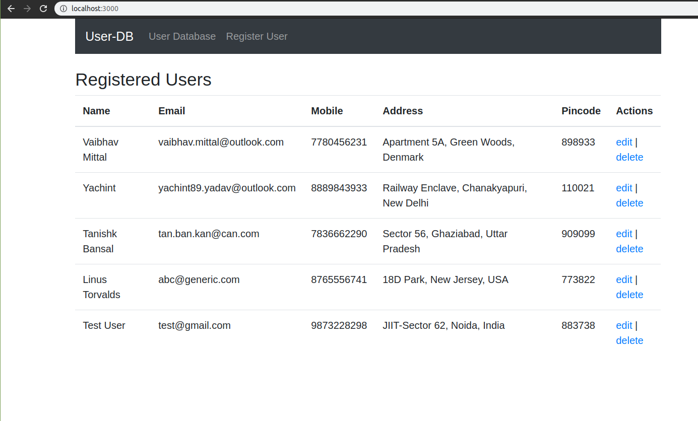

# mongodb-app
Basic Mongo-DB App built using Node JS and React-Redux.

<p float="left">


</p>


## Features
* Built using Node-Js and Express as Backend
* Uses MongoDB Atlas online database to store data
* Frontend hacked together using React-JS and Bootstrap
* Supports ALL basic CRUD applications on the Collection Provided

## Install

After downloading/cloning repository, follow the given commands to start the App.

```bash
cd mongodb-app
npm install
npm run dev
```

When both the scripts have launched, visit http://localhost:3000/ to launch the App.

## Screenshots



